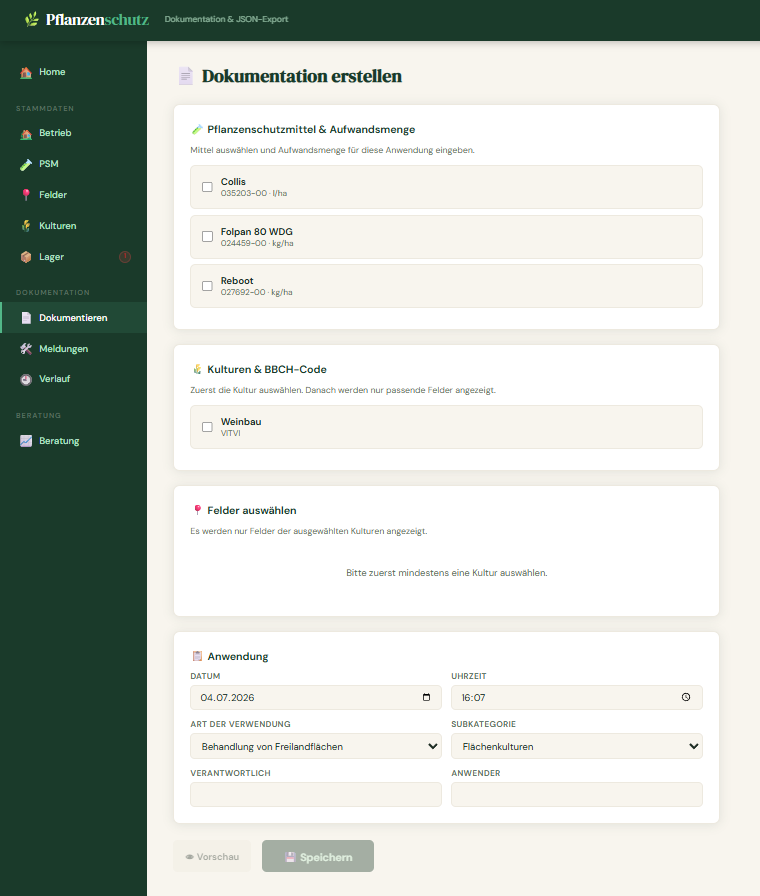
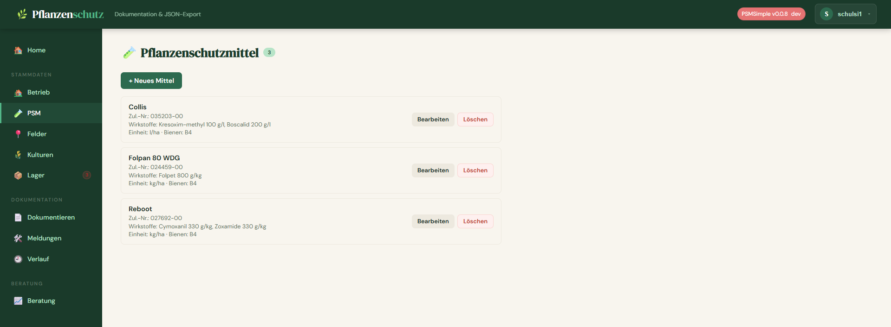
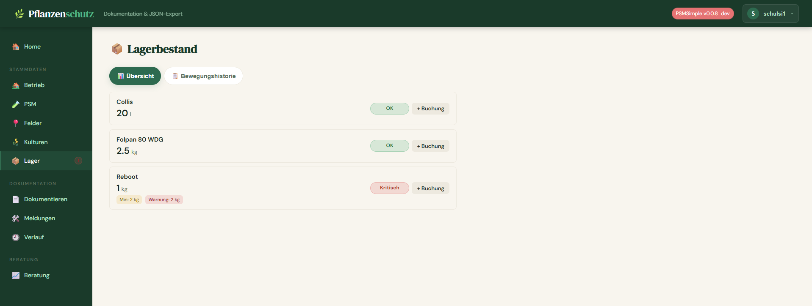

# 🌿 PSMSimple – Plant Protection Documentation

A web app for creating and managing plant protection application records in JSON format.

User documentation: <https://schulsi.github.io/PSMSimple>

---

## Table of Contents

- [Features](#features)
- [Requirements](#requirements)
- [Deployment with Docker Compose (recommended)](#deployment-with-docker-compose-recommended)
- [Deployment with Docker](#deployment-with-docker)
- [Local Development](#local-development)
- [Configuration](#configuration)
- [Data Storage](#data-storage)
- [API Documentation](#api-documentation)
- [Security Notes](#security-notes)

---

## Features

- **Farm**: Master data for your farm – automatically embedded in every JSON export
- **Plant Protection Products**: Reusable library of PPP master data
- **Application Sites**: Manage GPS coordinates and field areas
- **Crops**: Maintain and assign BBCH codes
- **JSON Export**: Document applications and download them as JSON
- **History**: View all previously logged applications
- **Spray Window Forecast**: Calculate optimal spray windows based on weather data (Open-Meteo)
- **PSM Advisory**: AI-powered product recommendations based on BVL approval data, weather, and application history
- **Inventory**: Track stock levels of plant protection products with movement history
- **Notifications / Reports**: Manage operational reports with status, type, field assignment, notes, and filtering
- **BBCH Management**: Create, edit, assign, and search BBCH stages per crop
- **User Management**: First registered user becomes admin; registration is disabled automatically afterwards
- **Role Management**: Admins can manage user roles and remove users
- **Personal Defaults**: Per-user defaults for application exports, such as applicator and responsible person
- **App Settings**: Admin settings for registration, advisory, forecast thresholds, and inventory defaults
- **Inventory Warnings**: Configurable warning and minimum stock levels with a sidebar badge
- **Version & Update Check**: Shows the installed version and checks GitHub releases for available updates
- **Secure Sessions**: CSRF protection, secure cookies, rate limiting, and security headers for safer deployments
- **Docker Deployment**: Docker/Compose setup with internal Redis support and a trimmed Docker build context

---

## Screenshots

### Documentation



### PSM



### Store



###

---

## Requirements

- [Docker](https://docs.docker.com/get-docker/) & [Docker Compose](https://docs.docker.com/compose/install/) ≥ v2

---

## Deployment with Docker Compose (recommended)

This is the recommended approach for production. Docker Compose starts the app alongside a Redis container for rate limiting.

### 1. Download `docker-compose.yaml`

```bash
mkdir psmsimple && cd psmsimple
curl -O https://raw.githubusercontent.com/schulsi/psmsimple/main/docker-compose.yaml
```

### 2. Set the secret key

Create a `.env` file in the same directory:

```bash
echo "SECRET_KEY=$(openssl rand -hex 32)" > .env
```

> ⚠️ Keep the `SECRET_KEY` safe and never share it publicly. It protects sessions and CSRF tokens.

### 3. Start

```bash
docker compose up -d
```

The app will be available at **`http://localhost:8080`**.

### 4. Check logs

```bash
docker compose logs -f app
```

### 5. Stop

```bash
docker compose down
```

---

## Deployment with Docker

For running without Docker Compose (e.g. without Redis):

```bash
docker run -d \
  --name psmsimple \
  -p 8080:8000 \
  -v $(pwd)/data:/data \
  -e SECRET_KEY="your-secret-key" \
  ghcr.io/schulsi/psmsimple:latest
```

> ℹ️ Without Redis, rate limiting runs in in-memory mode. This is sufficient for single instances but resets on restart.

The app will be available at **`http://localhost:8080`**.

---

## Local Development

### 1. Clone the repository

```bash
git clone https://github.com/schulsi/psmsimple.git
cd psmsimple
```

### 2. Set up a virtual environment

```bash
python -m venv .venv
source .venv/bin/activate  # Windows: .venv\Scripts\activate
```

### 3. Install dependencies

```bash
pip install -r requirements.txt
```

### 4. Set environment variables

```bash
export SECRET_KEY="dev-only-secret"
```

### 5. Start the app

```bash
python run.py
```

The app runs at **`http://localhost:5001`**.

---

## Configuration

The app is configured entirely via environment variables:

| Variable                | Required | Default           | Description                                                                                             |
|-------------------------|----------|-------------------|---------------------------------------------------------------------------------------------------------|
| `SECRET_KEY`            | ✅       | –                 | Cryptographic key for sessions and CSRF protection                                                      |
| `DATA_DIR`              | ❌       | `./data`          | Directory for databases, exports, and logs                                                              |
| `RATELIMIT_STORAGE_URI` | ❌       | `memory://`       | Redis URL for rate limiting, e.g. `redis://redis:6379/0`                                                |
| `LLM_PROVIDER`          | ❌       | `anthropic`       | LLM provider for PSM advisory (`anthropic` or `openai`)                                                 |
| `LLM_MODEL`             | ❌       | `provider default`| Model name to use, e.g. `claude-sonnet-4-20250514`. Falls back to the provider's default if not set.    |
| `ANTHROPIC_API_KEY`     | ❌       | –                 | API key for Anthropic. Required if `LLM_PROVIDER=anthropic`.                                            |
| `OPENAI_API_KEY`        | ❌       | –                 | API key for OpenAI. Required if `LLM_PROVIDER=openai`.                                                  |
| `AUTH_MODE`             | ❌       | `local`           | Authentication mode: `local`, `hybrid`, or `oidc`.                                                      |
| `OIDC_PROVIDER_NAME`    | ❌       | `SSO`             | Display name of the identity provider on the login page.                                                |
| `OIDC_ISSUER`           | with OIDC | –                 | OIDC issuer URL, without the `/.well-known/openid-configuration` suffix.                                |
| `OIDC_CLIENT_ID`        | with OIDC | –                 | Client ID registered for PSMSimple at the identity provider.                                            |
| `OIDC_CLIENT_SECRET`    | with OIDC | –                 | Client secret registered for PSMSimple. Keep this value private.                                        |
| `OIDC_SCOPES`           | ❌       | `openid profile email` | Space-separated OIDC scopes. `openid` must be included.                                              |
| `OIDC_DEFAULT_ROLE`     | ❌       | `read-only`       | Local role assigned to newly provisioned OIDC users.                                                    |
| `OIDC_AUTO_PROVISION`   | ❌       | `false`           | Whether a local user may be created automatically after a successful OIDC login.                        |

> ℹ️ The PSM advisory feature (AI recommendations) is optional. If no API key is configured, the advisory button is disabled in the UI. All other features work without an LLM key.

OIDC settings are required only when `AUTH_MODE` is `hybrid` or `oidc`. Register
`https://<your-host>/auth/oidc/callback` as an allowed redirect URI at the identity
provider. For a safe first-time setup, start in `hybrid` mode, sign in with the local
admin account, and open `/auth/oidc/link` to link that account. You can switch to
`oidc` mode afterwards. Automatic provisioning is optional and disabled by default.

---

## Data Storage

All persistent data is stored in the `DATA_DIR` directory (default: `./data`):

```text
data/
├── databases/
│   ├── users.db            # User accounts & roles
│   └── pflanzenschutz.db   # Application data
├── exports/                # Generated JSON exports
└── logs/
    └── psm.log             # Application log
```

Both databases are created automatically on first start.

> 💡 To back up all data, it is sufficient to copy the entire `data/` directory.

---

## API Documentation

The interactive Swagger UI is available at:

```text
http://localhost:8080/apidocs
```

> ℹ️ All API endpoints require an active session (cookie-based authentication). Log in via the web interface first, then use the Swagger UI to test requests.

---

## Security Notes

- The `SECRET_KEY` should be at least 32 random bytes long — use `openssl rand -hex 32` to generate one.
- For production, the app should be run behind a reverse proxy (e.g. nginx or Traefik) with TLS termination.
- API keys (`ANTHROPIC_API_KEY`, `OPENAI_API_KEY`) should be stored in the `.env` file and never committed to version control.

---

## Disclaimer

Parts of this project were created with the assistance of artificial intelligence (AI).
